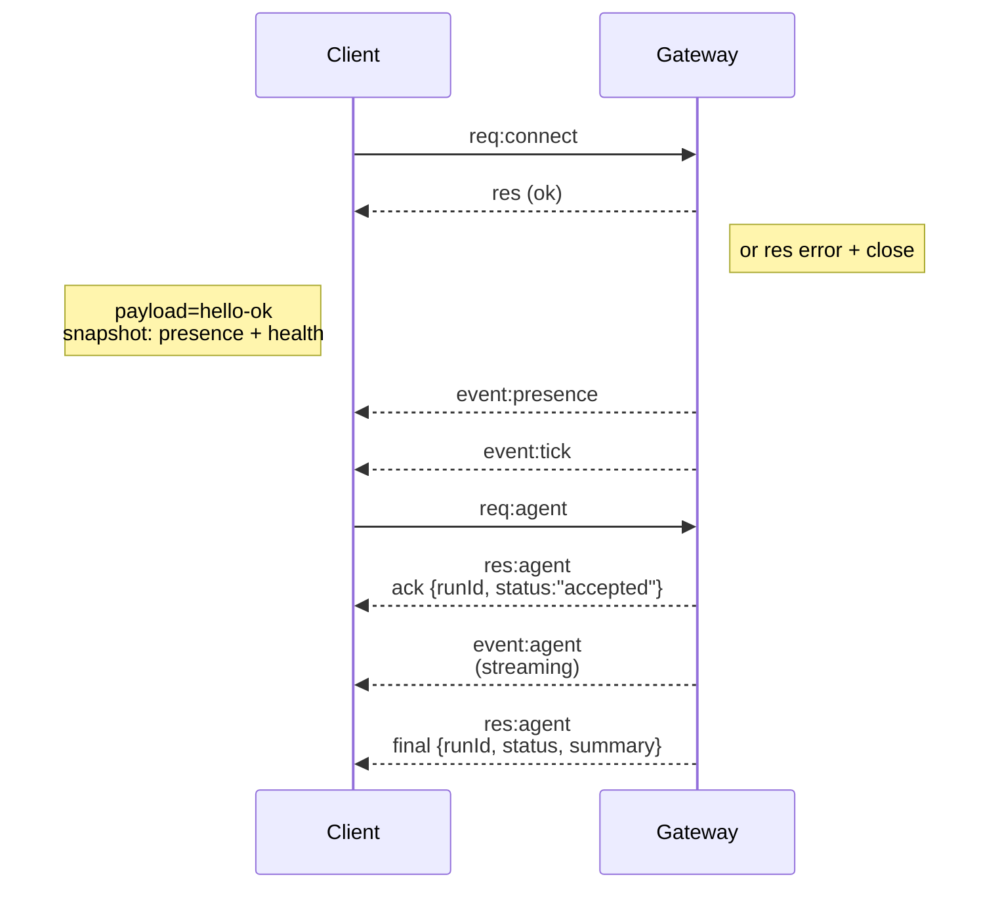

# OpenClaw Core Concepts

## Agent Runtime


# Agent Runtime 🤖

OpenClaw runs a single embedded agent runtime derived from **pi-mono**.

## Workspace (required)

OpenClaw uses a single agent workspace directory (`agents.defaults.workspace`) as the agent’s **only** working directory (`cwd`) for tools and context.

Recommended: use `openclaw setup` to create `~/.openclaw/openclaw.json` if missing and initialize the workspace files.

Full workspace layout + backup guide: [Agent workspace](/concepts/agent-workspace)

If `agents.defaults.sandbox` is enabled, non-main sessions can override this with
per-session workspaces under `agents.defaults.sandbox.workspaceRoot` (see
[Gateway configuration](/gateway/configuration)).

## Bootstrap files (injected)

Inside `agents.defaults.workspace`, OpenClaw expects these user-editable files:

- `AGENTS.md` — operating instructions + “memory”
- `SOUL.md` — persona, boundaries, tone
- `TOOLS.md` — user-maintained tool notes (e.g. `imsg`, `sag`, conventions)
- `BOOTSTRAP.md` — one-time first-run ritual (deleted after completion)
- `IDENTITY.md` — agent name/vibe/emoji
- `USER.md` — user profile + preferred address

On the first turn of a new session, OpenClaw injects the contents of these files directly into the agent context.

Blank files are skipped. Large files are trimmed and truncated with a marker so prompts stay lean (read the file for full content).

If a file is missing, OpenClaw injects a single “missing file” marker line (and `openclaw setup` will create a safe default template).

`BOOTSTRAP.md` is only created for a **brand new workspace** (no other bootstrap files present). If you delete it after completing the ritual, it should not be recreated on later restarts.

To disable bootstrap file creation entirely (for pre-seeded workspaces), set:

```json5
{ agent: { skipBootstrap: true } }
```

## Built-in tools

Core tools (read/exec/edit/write and related system tools) are always available,
subject to tool policy. `apply_patch` is optional and gated by
`tools.exec.applyPatch`. `TOOLS.md` does **not** control which tools exist; it’s
guidance for how _you_ want them used.

## Skills

OpenClaw loads skills from three locations (workspace wins on name conflict):

- Bundled (shipped with the install)
- Managed/local: `~/.openclaw/skills`
- Workspace: `<workspace>/skills`

Skills can be gated by config/env (see `skills` in [Gateway configuration](/gateway/configuration)).

## pi-mono integration

OpenClaw reuses pieces of the pi-mono codebase (models/tools), but **session management, discovery, and tool wiring are OpenClaw-owned**.

- No pi-coding agent runtime.
- No `~/.pi/agent` or `<workspace>/.pi` settings are consulted.

## Sessions

Session transcripts are stored as JSONL at:

- `~/.openclaw/agents/<agentId>/sessions/<SessionId>.jsonl`

The session ID is stable and chosen by OpenClaw.
Legacy Pi/Tau session folders are **not** read.

## Steering while streaming

When queue mode is `steer`, inbound messages are injected into the current run.
The queue is checked **after each tool call**; if a queued message is present,
remaining tool calls from the current assistant message are skipped (error tool
results with "Skipped due to queued user message."), then the queued user
message is injected before the next assistant response.

When queue mode is `followup` or `collect`, inbound messages are held until the
current turn ends, then a new agent turn starts with the queued payloads. See
[Queue](/concepts/queue) for mode + debounce/cap behavior.

Block streaming sends completed assistant blocks as soon as they finish; it is
**off by default** (`agents.defaults.blockStreamingDefault: "off"`).
Tune the boundary via `agents.defaults.blockStreamingBreak` (`text_end` vs `message_end`; defaults to text_end).
Control soft block chunking with `agents.defaults.blockStreamingChunk` (defaults to
800–1200 chars; prefers paragraph breaks, then newlines; sentences last).
Coalesce streamed chunks with `agents.defaults.blockStreamingCoalesce` to reduce
single-line spam (idle-based merging before send). Non-Telegram channels require
explicit `*.blockStreaming: true` to enable block replies.
Verbose tool summaries are emitted at tool start (no debounce); Control UI
streams tool output via agent events when available.
More details: [Streaming + chunking](/concepts/streaming).

## Model refs

Model refs in config (for example `agents.defaults.model` and `agents.defaults.models`) are parsed by splitting on the **first** `/`.

- Use `provider/model` when configuring models.
- If the model ID itself contains `/` (OpenRouter-style), include the provider prefix (example: `openrouter/moonshotai/kimi-k2`).
- If you omit the provider, OpenClaw treats the input as an alias or a model for the **default provider** (only works when there is no `/` in the model ID).

## Configuration (minimal)

At minimum, set:

- `agents.defaults.workspace`
- `channels.whatsapp.allowFrom` (strongly recommended)


_Next: [Group Chats](/channels/group-messages)_ 🦞

## Agent Workspace


# Agent workspace

The workspace is the agent's home. It is the only working directory used for
file tools and for workspace context. Keep it private and treat it as memory.

This is separate from `~/.openclaw/`, which stores config, credentials, and
sessions.

**Important:** the workspace is the **default cwd**, not a hard sandbox. Tools
resolve relative paths against the workspace, but absolute paths can still reach
elsewhere on the host unless sandboxing is enabled. If you need isolation, use
[`agents.defaults.sandbox`](/gateway/sandboxing) (and/or per‑agent sandbox config).
When sandboxing is enabled and `workspaceAccess` is not `"rw"`, tools operate
inside a sandbox workspace under `~/.openclaw/sandboxes`, not your host workspace.

## Default location

- Default: `~/.openclaw/workspace`
- If `OPENCLAW_PROFILE` is set and not `"default"`, the default becomes
  `~/.openclaw/workspace-<profile>`.
- Override in `~/.openclaw/openclaw.json`:

```json5
{
  agent: {
    workspace: "~/.openclaw/workspace",
  },
}
```

`openclaw onboard`, `openclaw configure`, or `openclaw setup` will create the
workspace and seed the bootstrap files if they are missing.

If you already manage the workspace files yourself, you can disable bootstrap
file creation:

```json5
{ agent: { skipBootstrap: true } }
```

## Extra workspace folders

Older installs may have created `~/openclaw`. Keeping multiple workspace
directories around can cause confusing auth or state drift, because only one
workspace is active at a time.

**Recommendation:** keep a single active workspace. If you no longer use the
extra folders, archive or move them to Trash (for example `trash ~/openclaw`).
If you intentionally keep multiple workspaces, make sure
`agents.defaults.workspace` points to the active one.

`openclaw doctor` warns when it detects extra workspace directories.

## Workspace file map (what each file means)

These are the standard files OpenClaw expects inside the workspace:

- `AGENTS.md`
  - Operating instructions for the agent and how it should use memory.
  - Loaded at the start of every session.
  - Good place for rules, priorities, and "how to behave" details.

- `SOUL.md`
  - Persona, tone, and boundaries.
  - Loaded every session.

- `USER.md`
  - Who the user is and how to address them.
  - Loaded every session.

- `IDENTITY.md`
  - The agent's name, vibe, and emoji.
  - Created/updated during the bootstrap ritual.

- `TOOLS.md`
  - Notes about your local tools and conventions.
  - Does not control tool availability; it is only guidance.

- `HEARTBEAT.md`
  - Optional tiny checklist for heartbeat runs.
  - Keep it short to avoid token burn.

- `BOOT.md`
  - Optional startup checklist executed on gateway restart when internal hooks are enabled.
  - Keep it short; use the message tool for outbound sends.

- `BOOTSTRAP.md`
  - One-time first-run ritual.
  - Only created for a brand-new workspace.
  - Delete it after the ritual is complete.

- `memory/YYYY-MM-DD.md`
  - Daily memory log (one file per day).
  - Recommended to read today + yesterday on session start.

- `MEMORY.md` (optional)
  - Curated long-term memory.
  - Only load in the main, private session (not shared/group contexts).

See [Memory](/concepts/memory) for the workflow and automatic memory flush.

- `skills/` (optional)
  - Workspace-specific skills.
  - Overrides managed/bundled skills when names collide.

- `canvas/` (optional)
  - Canvas UI files for node displays (for example `canvas/index.html`).

If any bootstrap file is missing, OpenClaw injects a "missing file" marker into
the session and continues. Large bootstrap files are truncated when injected;
adjust limits with `agents.defaults.bootstrapMaxChars` (default: 20000) and
`agents.defaults.bootstrapTotalMaxChars` (default: 150000).
`openclaw setup` can recreate missing defaults without overwriting existing
files.

## What is NOT in the workspace

These live under `~/.openclaw/` and should NOT be committed to the workspace repo:

- `~/.openclaw/openclaw.json` (config)
- `~/.openclaw/credentials/` (OAuth tokens, API keys)
- `~/.openclaw/agents/<agentId>/sessions/` (session transcripts + metadata)
- `~/.openclaw/skills/` (managed skills)

If you need to migrate sessions or config, copy them separately and keep them
out of version control.

## Git backup (recommended, private)

Treat the workspace as private memory. Put it in a **private** git repo so it is
backed up and recoverable.

Run these steps on the machine where the Gateway runs (that is where the
workspace lives).

### 1) Initialize the repo

If git is installed, brand-new workspaces are initialized automatically. If this
workspace is not already a repo, run:

```bash
cd ~/.openclaw/workspace
git init
git add AGENTS.md SOUL.md TOOLS.md IDENTITY.md USER.md HEARTBEAT.md memory/
git commit -m "Add agent workspace"
```

### 2) Add a private remote (beginner-friendly options)

Option A: GitHub web UI

1. Create a new **private** repository on GitHub.
2. Do not initialize with a README (avoids merge conflicts).
3. Copy the HTTPS remote URL.
4. Add the remote and push:

```bash
git branch -M main
git remote add origin <https-url>
git push -u origin main
```

Option B: GitHub CLI (`gh`)

```bash
gh auth login
gh repo create openclaw-workspace --private --source . --remote origin --push
```

Option C: GitLab web UI

1. Create a new **private** repository on GitLab.
2. Do not initialize with a README (avoids merge conflicts).
3. Copy the HTTPS remote URL.
4. Add the remote and push:

```bash
git branch -M main
git remote add origin <https-url>
git push -u origin main
```

### 3) Ongoing updates

```bash
git status
git add .
git commit -m "Update memory"
git push
```

## Do not commit secrets

Even in a private repo, avoid storing secrets in the workspace:

- API keys, OAuth tokens, passwords, or private credentials.
- Anything under `~/.openclaw/`.
- Raw dumps of chats or sensitive attachments.

If you must store sensitive references, use placeholders and keep the real
secret elsewhere (password manager, environment variables, or `~/.openclaw/`).

Suggested `.gitignore` starter:

```gitignore
.DS_Store
.env
**/*.key
**/*.pem
**/secrets*
```

## Moving the workspace to a new machine

1. Clone the repo to the desired path (default `~/.openclaw/workspace`).
2. Set `agents.defaults.workspace` to that path in `~/.openclaw/openclaw.json`.
3. Run `openclaw setup --workspace <path>` to seed any missing files.
4. If you need sessions, copy `~/.openclaw/agents/<agentId>/sessions/` from the
   old machine separately.

## Advanced notes

- Multi-agent routing can use different workspaces per agent. See
  [Channel routing](/channels/channel-routing) for routing configuration.
- If `agents.defaults.sandbox` is enabled, non-main sessions can use per-session sandbox
  workspaces under `agents.defaults.sandbox.workspaceRoot`.

## Architecture


# Gateway architecture

Last updated: 2026-01-22

## Overview

- A single long‑lived **Gateway** owns all messaging surfaces (WhatsApp via
  Baileys, Telegram via grammY, Slack, Discord, Signal, iMessage, WebChat).
- Control-plane clients (macOS app, CLI, web UI, automations) connect to the
  Gateway over **WebSocket** on the configured bind host (default
  `127.0.0.1:18789`).
- **Nodes** (macOS/iOS/Android/headless) also connect over **WebSocket**, but
  declare `role: node` with explicit caps/commands.
- One Gateway per host; it is the only place that opens a WhatsApp session.
- The **canvas host** is served by the Gateway HTTP server under:
  - `/__openclaw__/canvas/` (agent-editable HTML/CSS/JS)
  - `/__openclaw__/a2ui/` (A2UI host)
    It uses the same port as the Gateway (default `18789`).

## Components and flows

### Gateway (daemon)

- Maintains provider connections.
- Exposes a typed WS API (requests, responses, server‑push events).
- Validates inbound frames against JSON Schema.
- Emits events like `agent`, `chat`, `presence`, `health`, `heartbeat`, `cron`.

### Clients (mac app / CLI / web admin)

- One WS connection per client.
- Send requests (`health`, `status`, `send`, `agent`, `system-presence`).
- Subscribe to events (`tick`, `agent`, `presence`, `shutdown`).

### Nodes (macOS / iOS / Android / headless)

- Connect to the **same WS server** with `role: node`.
- Provide a device identity in `connect`; pairing is **device‑based** (role `node`) and
  approval lives in the device pairing store.
- Expose commands like `canvas.*`, `camera.*`, `screen.record`, `location.get`.

Protocol details:

- [Gateway protocol](/gateway/protocol)

### WebChat

- Static UI that uses the Gateway WS API for chat history and sends.
- In remote setups, connects through the same SSH/Tailscale tunnel as other
  clients.

## Connection lifecycle (single client)



## Wire protocol (summary)

- Transport: WebSocket, text frames with JSON payloads.
- First frame **must** be `connect`.
- After handshake:
  - Requests: `{type:"req", id, method, params}` → `{type:"res", id, ok, payload|error}`
  - Events: `{type:"event", event, payload, seq?, stateVersion?}`
- If `OPENCLAW_GATEWAY_TOKEN` (or `--token`) is set, `connect.params.auth.token`
  must match or the socket closes.
- Idempotency keys are required for side‑effecting methods (`send`, `agent`) to
  safely retry; the server keeps a short‑lived dedupe cache.
- Nodes must include `role: "node"` plus caps/commands/permissions in `connect`.

## Pairing + local trust

- All WS clients (operators + nodes) include a **device identity** on `connect`.
- New device IDs require pairing approval; the Gateway issues a **device token**
  for subsequent connects.
- **Local** connects (loopback or the gateway host’s own tailnet address) can be
  auto‑approved to keep same‑host UX smooth.
- All connects must sign the `connect.challenge` nonce.
- Signature payload `v3` also binds `platform` + `deviceFamily`; the gateway
  pins paired metadata on reconnect and requires repair pairing for metadata
  changes.
- **Non‑local** connects still require explicit approval.
- Gateway auth (`gateway.auth.*`) still applies to **all** connections, local or
  remote.

Details: [Gateway protocol](/gateway/protocol), [Pairing](/channels/pairing),
[Security](/gateway/security).

## Protocol typing and codegen

- TypeBox schemas define the protocol.
- JSON Schema is generated from those schemas.
- Swift models are generated from the JSON Schema.

## Remote access

- Preferred: Tailscale or VPN.
- Alternative: SSH tunnel

  ```bash
  ssh -N -L 18789:127.0.0.1:18789 user@host
  ```

- The same handshake + auth token apply over the tunnel.
- TLS + optional pinning can be enabled for WS in remote setups.

## Operations snapshot

- Start: `openclaw gateway` (foreground, logs to stdout).
- Health: `health` over WS (also included in `hello-ok`).
- Supervision: launchd/systemd for auto‑restart.

## Invariants

- Exactly one Gateway controls a single Baileys session per host.
- Handshake is mandatory; any non‑JSON or non‑connect first frame is a hard close.
- Events are not replayed; clients must refresh on gaps.

## Compaction


# Context Window & Compaction

Every model has a **context window** (max tokens it can see). Long-running chats accumulate messages and tool results; once the window is tight, OpenClaw **compacts** older history to stay within limits.

## What compaction is

Compaction **summarizes older conversation** into a compact summary entry and keeps recent messages intact. The summary is stored in the session history, so future requests use:

- The compaction summary
- Recent messages after the compaction point

Compaction **persists** in the session’s JSONL history.

## Configuration

Use the `agents.defaults.compaction` setting in your `openclaw.json` to configure compaction behavior (mode, target tokens, etc.).

## Auto-compaction (default on)

When a session nears or exceeds the model’s context window, OpenClaw triggers auto-compaction and may retry the original request using the compacted context.

You’ll see:

- `🧹 Auto-compaction complete` in verbose mode
- `/status` showing `🧹 Compactions: <count>`

Before compaction, OpenClaw can run a **silent memory flush** turn to store
durable notes to disk. See [Memory](/concepts/memory) for details and config.

## Manual compaction

Use `/compact` (optionally with instructions) to force a compaction pass:

```
/compact Focus on decisions and open questions
```

## Context window source

Context window is model-specific. OpenClaw uses the model definition from the configured provider catalog to determine limits.

## Compaction vs pruning

- **Compaction**: summarises and **persists** in JSONL.
- **Session pruning**: trims old **tool results** only, **in-memory**, per request.

See [/concepts/session-pruning](/concepts/session-pruning) for pruning details.

## Tips

- Use `/compact` when sessions feel stale or context is bloated.
- Large tool outputs are already truncated; pruning can further reduce tool-result buildup.
- If you need a fresh slate, `/new` or `/reset` starts a new session id.

## Memory


# Memory

OpenClaw memory is **plain Markdown in the agent workspace**. The files are the
source of truth; the model only "remembers" what gets written to disk.

Memory search tools are provided by the active memory plugin (default:
`memory-core`). Disable memory plugins with `plugins.slots.memory = "none"`.

## Memory files (Markdown)

The default workspace layout uses two memory layers:

- `memory/YYYY-MM-DD.md`
  - Daily log (append-only).
  - Read today + yesterday at session start.
- `MEMORY.md` (optional)
  - Curated long-term memory.
  - **Only load in the main, private session** (never in group contexts).

These files live under the workspace (`agents.defaults.workspace`, default
`~/.openclaw/workspace`). See [Agent workspace](/concepts/agent-workspace) for the full layout.

## Memory tools

OpenClaw exposes two agent-facing tools for these Markdown files:

- `memory_search` — semantic recall over indexed snippets.
- `memory_get` — targeted read of a specific Markdown file/line range.

`memory_get` now **degrades gracefully when a file doesn't exist** (for example,
today's daily log before the first write). Both the builtin manager and the QMD
backend return `{ text: "", path }` instead of throwing `ENOENT`, so agents can
handle "nothing recorded yet" and continue their workflow without wrapping the
tool call in try/catch logic.

## When to write memory

- Decisions, preferences, and durable facts go to `MEMORY.md`.
- Day-to-day notes and running context go to `memory/YYYY-MM-DD.md`.
- If someone says "remember this," write it down (do not keep it in RAM).
- This area is still evolving. It helps to remind the model to store memories; it will know what to do.
- If you want something to stick, **ask the bot to write it** into memory.

## Automatic memory flush (pre-compaction ping)

When a session is **close to auto-compaction**, OpenClaw triggers a **silent,
agentic turn** that reminds the model to write durable memory **before** the
context is compacted. The default prompts explicitly say the model _may reply_,
but usually `NO_REPLY` is the correct response so the user never sees this turn.

This is controlled by `agents.defaults.compaction.memoryFlush`:

```json5
{
  agents: {
    defaults: {
      compaction: {
        reserveTokensFloor: 20000,
        memoryFlush: {
          enabled: true,
          softThresholdTokens: 4000,
          systemPrompt: "Session nearing compaction. Store durable memories now.",
          prompt: "Write any lasting notes to memory/YYYY-MM-DD.md; reply with NO_REPLY if nothing to store.",
        },
      },
    },
  },
}
```

Details:

- **Soft threshold**: flush triggers when the session token estimate crosses
  `contextWindow - reserveTokensFloor - softThresholdTokens`.
- **Silent** by default: prompts include `NO_REPLY` so nothing is delivered.
- **Two prompts**: a user prompt plus a system prompt append the reminder.
- **One flush per compaction cycle** (tracked in `sessions.json`).
- **Workspace must be writable**: if the session runs sandboxed with
  `workspaceAccess: "ro"` or `"none"`, the flush is skipped.

For the full compaction lifecycle, see
[Session management + compaction](/reference/session-management-compaction).

## Vector memory search

OpenClaw can build a small vector index over `MEMORY.md` and `memory/*.md` so
semantic queries can find related notes even when wording differs.

Defaults:

- Enabled by default.
- Watches memory files for changes (debounced).
- Configure memory search under `agents.defaults.memorySearch` (not top-level
  `memorySearch`).
- Uses remote embeddings by default. If `memorySearch.provider` is not set, OpenClaw auto-selects:
  1. `local` if a `memorySearch.local.modelPath` is configured and the file exists.
  2. `openai` if an OpenAI key can be resolved.
  3. `gemini` if a Gemini key can be resolved.
  4. `voyage` if a Voyage key can be resolved.
  5. `mistral` if a Mistral key can be resolved.
  6. Otherwise memory search stays disabled until configured.
- Local mode uses node-llama-cpp and may require `pnpm approve-builds`.
- Uses sqlite-vec (when available) to accelerate vector search inside SQLite.

Remote embeddings **require** an API key for the embedding provider. OpenClaw
resolves keys from auth profiles, `models.providers.*.apiKey`, or environment
variables. Codex OAuth only covers chat/completions and does **not** satisfy
embeddings for memory search. For Gemini, use `GEMINI_API_KEY` or
`models.providers.google.apiKey`. For Voyage, use `VOYAGE_API_KEY` or
`models.providers.voyage.apiKey`. For Mistral, use `MISTRAL_API_KEY` or
`models.providers.mistral.apiKey`.
When using a custom OpenAI-compatible endpoint,
set `memorySearch.remote.apiKey` (and optional `memorySearch.remote.headers`).

### QMD backend (experimental)

Set `memory.backend = "qmd"` to swap the built-in SQLite indexer for
[QMD](https://github.com/tobi/qmd): a local-first search sidecar that combines
BM25 + vectors + reranking. Markdown stays the source of truth; OpenClaw shells
out to QMD for retrieval. Key points:

**Prereqs**

- Disabled by default. Opt in per-config (`memory.backend = "qmd"`).
- Install the QMD CLI separately (`bun install -g https://github.com/tobi/qmd` or grab
  a release) and make sure the `qmd` binary is on the gateway’s `PATH`.
- QMD needs an SQLite build that allows extensions (`brew install sqlite` on
  macOS).
- QMD runs fully locally via Bun + `node-llama-cpp` and auto-downloads GGUF
  models from HuggingFace on first use (no separate Ollama daemon required).
- The gateway runs QMD in a self-contained XDG home under
  `~/.openclaw/agents/<agentId>/qmd/` by setting `XDG_CONFIG_HOME` and
  `XDG_CACHE_HOME`.
- OS support: macOS and Linux work out of the box once Bun + SQLite are
  installed. Windows is best supported via WSL2.

**How the sidecar runs**

- The gateway writes a self-contained QMD home under
  `~/.openclaw/agents/<agentId>/qmd/` (config + cache + sqlite DB).
- Collections are created via `qmd collection add` from `memory.qmd.paths`
  (plus default workspace memory files), then `qmd update` + `qmd embed` run
  on boot and on a configurable interval (`memory.qmd.update.interval`,
  default 5 m).
- The gateway now initializes the QMD manager on startup, so periodic update
  timers are armed even before the first `memory_search` call.
- Boot refresh now runs in the background by default so chat startup is not
  blocked; set `memory.qmd.update.waitForBootSync = true` to keep the previous
  blocking behavior.
- Searches run via `memory.qmd.searchMode` (default `qmd search --json`; also
  supports `vsearch` and `query`). If the selected mode rejects flags on your
  QMD build, OpenClaw retries with `qmd query`. If QMD fails or the binary is
  missing, OpenClaw automatically falls back to the builtin SQLite manager so
  memory tools keep working.
- OpenClaw does not expose QMD embed batch-size tuning today; batch behavior is
  controlled by QMD itself.
- **First search may be slow**: QMD may download local GGUF models (reranker/query
  expansion) on the first `qmd query` run.
  - OpenClaw sets `XDG_CONFIG_HOME`/`XDG_CACHE_HOME` automatically when it runs QMD.
  - If you want to pre-download models manually (and warm the same index OpenClaw
    uses), run a one-off query with the agent’s XDG dirs.

    OpenClaw’s QMD state lives under your **state dir** (defaults to `~/.openclaw`).
    You can point `qmd` at the exact same index by exporting the same XDG vars
    OpenClaw uses:

    ```bash
    # Pick the same state dir OpenClaw uses
    STATE_DIR="${OPENCLAW_STATE_DIR:-$HOME/.openclaw}"

    export XDG_CONFIG_HOME="$STATE_DIR/agents/main/qmd/xdg-config"
    export XDG_CACHE_HOME="$STATE_DIR/agents/main/qmd/xdg-cache"

    # (Optional) force an index refresh + embeddings
    qmd update
    qmd embed

    # Warm up / trigger first-time model downloads
    qmd query "test" -c memory-root --json >/dev/null 2>&1
    ```

**Config surface (`memory.qmd.*`)**

- `command` (default `qmd`): override the executable path.
- `searchMode` (default `search`): pick which QMD command backs
  `memory_search` (`search`, `vsearch`, `query`).
- `includeDefaultMemory` (default `true`): auto-index `MEMORY.md` + `memory/**/*.md`.
- `paths[]`: add extra directories/files (`path`, optional `pattern`, optional
  stable `name`).
- `sessions`: opt into session JSONL indexing (`enabled`, `retentionDays`,
  `exportDir`).
- `update`: controls refresh cadence and maintenance execution:
  (`interval`, `debounceMs`, `onBoot`, `waitForBootSync`, `embedInterval`,
  `commandTimeoutMs`, `updateTimeoutMs`, `embedTimeoutMs`).
- `limits`: clamp recall payload (`maxResults`, `maxSnippetChars`,
  `maxInjectedChars`, `timeoutMs`).
- `scope`: same schema as [`session.sendPolicy`](/gateway/configuration#session).
  Default is DM-only (`deny` all, `allow` direct chats); loosen it to surface QMD
  hits in groups/channels.
  - `match.keyPrefix` matches the **normalized** session key (lowercased, with any
    leading `agent:<id>:` stripped). Example: `discord:channel:`.
  - `match.rawKeyPrefix` matches the **raw** session key (lowercased), including
    `agent:<id>:`. Example: `agent:main:discord:`.
  - Legacy: `match.keyPrefix: "agent:..."` is still treated as a raw-key prefix,
    but prefer `rawKeyPrefix` for clarity.
- When `scope` denies a search, OpenClaw logs a warning with the derived
  `channel`/`chatType` so empty results are easier to debug.
- Snippets sourced outside the workspace show up as
  `qmd/<collection>/<relative-path>` in `memory_search` results; `memory_get`
  understands that prefix and reads from the configured QMD collection root.
- When `memory.qmd.sessions.enabled = true`, OpenClaw exports sanitized session
  transcripts (User/Assistant turns) into a dedicated QMD collection under
  `~/.openclaw/agents/<id>/qmd/sessions/`, so `memory_search` can recall recent
  conversations without touching the builtin SQLite index.
- `memory_search` snippets now include a `Source: <path#line>` footer when
  `memory.citations` is `auto`/`on`; set `memory.citations = "off"` to keep
  the path metadata internal (the agent still receives the path for
  `memory_get`, but the snippet text omits the footer and the system prompt
  warns the agent not to cite it).

**Example**

```json5
memory: {
  backend: "qmd",
  citations: "auto",
  qmd: {
    includeDefaultMemory: true,
    update: { interval: "5m", debounceMs: 15000 },
    limits: { maxResults: 6, timeoutMs: 4000 },
    scope: {
      default: "deny",
      rules: [
        { action: "allow", match: { chatType: "direct" } },
        // Normalized session-key prefix (strips `agent:<id>:`).
        { action: "deny", match: { keyPrefix: "discord:channel:" } },
        // Raw session-key prefix (includes `agent:<id>:`).
        { action: "deny", match: { rawKeyPrefix: "agent:main:discord:" } },
      ]
    },
    paths: [
      { name: "docs", path: "~/notes", pattern: "**/*.md" }
    ]
  }
}
```

**Citations & fallback**

- `memory.citations` applies regardless of backend (`auto`/`on`/`off`).
- When `qmd` runs, we tag `status().backend = "qmd"` so diagnostics show which
  engine served the results. If the QMD subprocess exits or JSON output can’t be
  parsed, the search manager logs a warning and returns the builtin provider
  (existing Markdown embeddings) until QMD recovers.

### Additional memory paths

If you want to index Markdown files outside the default workspace layout, add
explicit paths:

```json5
agents: {
  defaults: {
    memorySearch: {
      extraPaths: ["../team-docs", "/srv/shared-notes/overview.md"]
    }
  }
}
```

Notes:

- Paths can be absolute or workspace-relative.
- Directories are scanned recursively for `.md` files.
- Only Markdown files are indexed.
- Symlinks are ignored (files or directories).

### Gemini embeddings (native)

Set the provider to `gemini` to use the Gemini embeddings API directly:

```json5
agents: {
  defaults: {
    memorySearch: {
      provider: "gemini",
      model: "gemini-embedding-001",
      remote: {
        apiKey: "YOUR_GEMINI_API_KEY"
      }
    }
  }
}
```

Notes:

- `remote.baseUrl` is optional (defaults to the Gemini API base URL).
- `remote.headers` lets you add extra headers if needed.
- Default model: `gemini-embedding-001`.

If you want to use a **custom OpenAI-compatible endpoint** (OpenRouter, vLLM, or a proxy),
you can use the `remote` configuration with the OpenAI provider:

```json5
agents: {
  defaults: {
    memorySearch: {
      provider: "openai",
      model: "text-embedding-3-small",
      remote: {
        baseUrl: "https://api.example.com/v1/",
        apiKey: "YOUR_OPENAI_COMPAT_API_KEY",
        headers: { "X-Custom-Header": "value" }
      }
    }
  }
}
```

If you don't want to set an API key, use `memorySearch.provider = "local"` or set
`memorySearch.fallback = "none"`.

Fallbacks:

- `memorySearch.fallback` can be `openai`, `gemini`, `voyage`, `mistral`, `local`, or `none`.
- The fallback provider is only used when the primary embedding provider fails.

Batch indexing (OpenAI + Gemini + Voyage):

- Disabled by default. Set `agents.defaults.memorySearch.remote.batch.enabled = true` to enable for large-corpus indexing (OpenAI, Gemini, and Voyage).
- Default behavior waits for batch completion; tune `remote.batch.wait`, `remote.batch.pollIntervalMs`, and `remote.batch.timeoutMinutes` if needed.
- Set `remote.batch.concurrency` to control how many batch jobs we submit in parallel (default: 2).
- Batch mode applies when `memorySearch.provider = "openai"` or `"gemini"` and uses the corresponding API key.
- Gemini batch jobs use the async embeddings batch endpoint and require Gemini Batch API availability.

Why OpenAI batch is fast + cheap:

- For large backfills, OpenAI is typically the fastest option we support because we can submit many embedding requests in a single batch job and let OpenAI process them asynchronously.
- OpenAI offers discounted pricing for Batch API workloads, so large indexing runs are usually cheaper than sending the same requests synchronously.
- See the OpenAI Batch API docs and pricing for details:
  - [https://platform.openai.com/docs/api-reference/batch](https://platform.openai.com/docs/api-reference/batch)
  - [https://platform.openai.com/pricing](https://platform.openai.com/pricing)

Config example:

```json5
agents: {
  defaults: {
    memorySearch: {
      provider: "openai",
      model: "text-embedding-3-small",
      fallback: "openai",
      remote: {
        batch: { enabled: true, concurrency: 2 }
      },
      sync: { watch: true }
    }
  }
}
```

Tools:

- `memory_search` — returns snippets with file + line ranges.
- `memory_get` — read memory file content by path.

Local mode:

- Set `agents.defaults.memorySearch.provider = "local"`.
- Provide `agents.defaults.memorySearch.local.modelPath` (GGUF or `hf:` URI).
- Optional: set `agents.defaults.memorySearch.fallback = "none"` to avoid remote fallback.

### How the memory tools work

- `memory_search` semantically searches Markdown chunks (~400 token target, 80-token overlap) from `MEMORY.md` + `memory/**/*.md`. It returns snippet text (capped ~700 chars), file path, line range, score, provider/model, and whether we fell back from local → remote embeddings. No full file payload is returned.
- `memory_get` reads a specific memory Markdown file (workspace-relative), optionally from a starting line and for N lines. Paths outside `MEMORY.md` / `memory/` are rejected.
- Both tools are enabled only when `memorySearch.enabled` resolves true for the agent.

### What gets indexed (and when)

- File type: Markdown only (`MEMORY.md`, `memory/**/*.md`).
- Index storage: per-agent SQLite at `~/.openclaw/memory/<agentId>.sqlite` (configurable via `agents.defaults.memorySearch.store.path`, supports `{agentId}` token).
- Freshness: watcher on `MEMORY.md` + `memory/` marks the index dirty (debounce 1.5s). Sync is scheduled on session start, on search, or on an interval and runs asynchronously. Session transcripts use delta thresholds to trigger background sync.
- Reindex triggers: the index stores the embedding **provider/model + endpoint fingerprint + chunking params**. If any of those change, OpenClaw automatically resets and reindexes the entire store.

### Hybrid search (BM25 + vector)

When enabled, OpenClaw combines:

- **Vector similarity** (semantic match, wording can differ)
- **BM25 keyword relevance** (exact tokens like IDs, env vars, code symbols)

If full-text search is unavailable on your platform, OpenClaw falls back to vector-only search.

#### Why hybrid?

Vector search is great at “this means the same thing”:

- “Mac Studio gateway host” vs “the machine running the gateway”
- “debounce file updates” vs “avoid indexing on every write”

But it can be weak at exact, high-signal tokens:

- IDs (`a828e60`, `b3b9895a…`)
- code symbols (`memorySearch.query.hybrid`)
- error strings ("sqlite-vec unavailable")

BM25 (full-text) is the opposite: strong at exact tokens, weaker at paraphrases.
Hybrid search is the pragmatic middle ground: **use both retrieval signals** so you get
good results for both "natural language" queries and "needle in a haystack" queries.

#### How we merge results (the current design)

Implementation sketch:

1. Retrieve a candidate pool from both sides:

- **Vector**: top `maxResults * candidateMultiplier` by cosine similarity.
- **BM25**: top `maxResults * candidateMultiplier` by FTS5 BM25 rank (lower is better).

2. Convert BM25 rank into a 0..1-ish score:

- `textScore = 1 / (1 + max(0, bm25Rank))`

3. Union candidates by chunk id and compute a weighted score:

- `finalScore = vectorWeight * vectorScore + textWeight * textScore`

Notes:

- `vectorWeight` + `textWeight` is normalized to 1.0 in config resolution, so weights behave as percentages.
- If embeddings are unavailable (or the provider returns a zero-vector), we still run BM25 and return keyword matches.
- If FTS5 can't be created, we keep vector-only search (no hard failure).

This isn't "IR-theory perfect", but it's simple, fast, and tends to improve recall/precision on real notes.
If we want to get fancier later, common next steps are Reciprocal Rank Fusion (RRF) or score normalization
(min/max or z-score) before mixing.

#### Post-processing pipeline

After merging vector and keyword scores, two optional post-processing stages
refine the result list before it reaches the agent:

```
Vector + Keyword → Weighted Merge → Temporal Decay → Sort → MMR → Top-K Results
```

Both stages are **off by default** and can be enabled independently.

#### MMR re-ranking (diversity)

When hybrid search returns results, multiple chunks may contain similar or overlapping content.
For example, searching for "home network setup" might return five nearly identical snippets
from different daily notes that all mention the same router configuration.

**MMR (Maximal Marginal Relevance)** re-ranks the results to balance relevance with diversity,
ensuring the top results cover different aspects of the query instead of repeating the same information.

How it works:

1. Results are scored by their original relevance (vector + BM25 weighted score).
2. MMR iteratively selects results that maximize: `λ × relevance − (1−λ) × max_similarity_to_selected`.
3. Similarity between results is measured using Jaccard text similarity on tokenized content.

The `lambda` parameter controls the trade-off:

- `lambda = 1.0` → pure relevance (no diversity penalty)
- `lambda = 0.0` → maximum diversity (ignores relevance)
- Default: `0.7` (balanced, slight relevance bias)

**Example — query: "home network setup"**

Given these memory files:

```
memory/2026-02-10.md  → "Configured Omada router, set VLAN 10 for IoT devices"
memory/2026-02-08.md  → "Configured Omada router, moved IoT to VLAN 10"
memory/2026-02-05.md  → "Set up AdGuard DNS on 192.168.10.2"
memory/network.md     → "Router: Omada ER605, AdGuard: 192.168.10.2, VLAN 10: IoT"
```

Without MMR — top 3 results:

```
1. memory/2026-02-10.md  (score: 0.92)  ← router + VLAN
2. memory/2026-02-08.md  (score: 0.89)  ← router + VLAN (near-duplicate!)
3. memory/network.md     (score: 0.85)  ← reference doc
```

With MMR (λ=0.7) — top 3 results:

```
1. memory/2026-02-10.md  (score: 0.92)  ← router + VLAN
2. memory/network.md     (score: 0.85)  ← reference doc (diverse!)
3. memory/2026-02-05.md  (score: 0.78)  ← AdGuard DNS (diverse!)
```

The near-duplicate from Feb 8 drops out, and the agent gets three distinct pieces of information.

**When to enable:** If you notice `memory_search` returning redundant or near-duplicate snippets,
especially with daily notes that often repeat similar information across days.

#### Temporal decay (recency boost)

Agents with daily notes accumulate hundreds of dated files over time. Without decay,
a well-worded note from six months ago can outrank yesterday's update on the same topic.

**Temporal decay** applies an exponential multiplier to scores based on the age of each result,
so recent memories naturally rank higher while old ones fade:

```
decayedScore = score × e^(-λ × ageInDays)
```

where `λ = ln(2) / halfLifeDays`.

With the default half-life of 30 days:

- Today's notes: **100%** of original score
- 7 days ago: **~84%**
- 30 days ago: **50%**
- 90 days ago: **12.5%**
- 180 days ago: **~1.6%**

**Evergreen files are never decayed:**

- `MEMORY.md` (root memory file)
- Non-dated files in `memory/` (e.g., `memory/projects.md`, `memory/network.md`)
- These contain durable reference information that should always rank normally.

**Dated daily files** (`memory/YYYY-MM-DD.md`) use the date extracted from the filename.
Other sources (e.g., session transcripts) fall back to file modification time (`mtime`).

**Example — query: "what's Rod's work schedule?"**

Given these memory files (today is Feb 10):

```
memory/2025-09-15.md  → "Rod works Mon-Fri, standup at 10am, pairing at 2pm"  (148 days old)
memory/2026-02-10.md  → "Rod has standup at 14:15, 1:1 with Zeb at 14:45"    (today)
memory/2026-02-03.md  → "Rod started new team, standup moved to 14:15"        (7 days old)
```

Without decay:

```
1. memory/2025-09-15.md  (score: 0.91)  ← best semantic match, but stale!
2. memory/2026-02-10.md  (score: 0.82)
3. memory/2026-02-03.md  (score: 0.80)
```

With decay (halfLife=30):

```
1. memory/2026-02-10.md  (score: 0.82 × 1.00 = 0.82)  ← today, no decay
2. memory/2026-02-03.md  (score: 0.80 × 0.85 = 0.68)  ← 7 days, mild decay
3. memory/2025-09-15.md  (score: 0.91 × 0.03 = 0.03)  ← 148 days, nearly gone
```

The stale September note drops to the bottom despite having the best raw semantic match.

**When to enable:** If your agent has months of daily notes and you find that old,
stale information outranks recent context. A half-life of 30 days works well for
daily-note-heavy workflows; increase it (e.g., 90 days) if you reference older notes frequently.

#### Configuration

Both features are configured under `memorySearch.query.hybrid`:

```json5
agents: {
  defaults: {
    memorySearch: {
      query: {
        hybrid: {
          enabled: true,
          vectorWeight: 0.7,
          textWeight: 0.3,
          candidateMultiplier: 4,
          // Diversity: reduce redundant results
          mmr: {
            enabled: true,    // default: false
            lambda: 0.7       // 0 = max diversity, 1 = max relevance
          },
          // Recency: boost newer memories
          temporalDecay: {
            enabled: true,    // default: false
            halfLifeDays: 30  // score halves every 30 days
          }
        }
      }
    }
  }
}
```

You can enable either feature independently:

- **MMR only** — useful when you have many similar notes but age doesn't matter.
- **Temporal decay only** — useful when recency matters but your results are already diverse.
- **Both** — recommended for agents with large, long-running daily note histories.

### Embedding cache

OpenClaw can cache **chunk embeddings** in SQLite so reindexing and frequent updates (especially session transcripts) don't re-embed unchanged text.

Config:

```json5
agents: {
  defaults: {
    memorySearch: {
      cache: {
        enabled: true,
        maxEntries: 50000
      }
    }
  }
}
```

### Session memory search (experimental)

You can optionally index **session transcripts** and surface them via `memory_search`.
This is gated behind an experimental flag.

```json5
agents: {
  defaults: {
    memorySearch: {
      experimental: { sessionMemory: true },
      sources: ["memory", "sessions"]
    }
  }
}
```

Notes:

- Session indexing is **opt-in** (off by default).
- Session updates are debounced and **indexed asynchronously** once they cross delta thresholds (best-effort).
- `memory_search` never blocks on indexing; results can be slightly stale until background sync finishes.
- Results still include snippets only; `memory_get` remains limited to memory files.
- Session indexing is isolated per agent (only that agent’s session logs are indexed).
- Session logs live on disk (`~/.openclaw/agents/<agentId>/sessions/*.jsonl`). Any process/user with filesystem access can read them, so treat disk access as the trust boundary. For stricter isolation, run agents under separate OS users or hosts.

Delta thresholds (defaults shown):

```json5
agents: {
  defaults: {
    memorySearch: {
      sync: {
        sessions: {
          deltaBytes: 100000,   // ~100 KB
          deltaMessages: 50     // JSONL lines
        }
      }
    }
  }
}
```

### SQLite vector acceleration (sqlite-vec)

When the sqlite-vec extension is available, OpenClaw stores embeddings in a
SQLite virtual table (`vec0`) and performs vector distance queries in the
database. This keeps search fast without loading every embedding into JS.

Configuration (optional):

```json5
agents: {
  defaults: {
    memorySearch: {
      store: {
        vector: {
          enabled: true,
          extensionPath: "/path/to/sqlite-vec"
        }
      }
    }
  }
}
```

Notes:

- `enabled` defaults to true; when disabled, search falls back to in-process
  cosine similarity over stored embeddings.
- If the sqlite-vec extension is missing or fails to load, OpenClaw logs the
  error and continues with the JS fallback (no vector table).
- `extensionPath` overrides the bundled sqlite-vec path (useful for custom builds
  or non-standard install locations).

### Local embedding auto-download

- Default local embedding model: `hf:ggml-org/embeddinggemma-300m-qat-q8_0-GGUF/embeddinggemma-300m-qat-Q8_0.gguf` (~0.6 GB).
- When `memorySearch.provider = "local"`, `node-llama-cpp` resolves `modelPath`; if the GGUF is missing it **auto-downloads** to the cache (or `local.modelCacheDir` if set), then loads it. Downloads resume on retry.
- Native build requirement: run `pnpm approve-builds`, pick `node-llama-cpp`, then `pnpm rebuild node-llama-cpp`.
- Fallback: if local setup fails and `memorySearch.fallback = "openai"`, we automatically switch to remote embeddings (`openai/text-embedding-3-small` unless overridden) and record the reason.

### Custom OpenAI-compatible endpoint example

```json5
agents: {
  defaults: {
    memorySearch: {
      provider: "openai",
      model: "text-embedding-3-small",
      remote: {
        baseUrl: "https://api.example.com/v1/",
        apiKey: "YOUR_REMOTE_API_KEY",
        headers: {
          "X-Organization": "org-id",
          "X-Project": "project-id"
        }
      }
    }
  }
}
```

Notes:

- `remote.*` takes precedence over `models.providers.openai.*`.
- `remote.headers` merge with OpenAI headers; remote wins on key conflicts. Omit `remote.headers` to use the OpenAI defaults.

## Model-providers


# Model providers

This page covers **LLM/model providers** (not chat channels like WhatsApp/Telegram).
For model selection rules, see [/concepts/models](/concepts/models).

## Quick rules

- Model refs use `provider/model` (example: `opencode/claude-opus-4-6`).
- If you set `agents.defaults.models`, it becomes the allowlist.
- CLI helpers: `openclaw onboard`, `openclaw models list`, `openclaw models set <provider/model>`.

## API key rotation

- Supports generic provider rotation for selected providers.
- Configure multiple keys via:
  - `OPENCLAW_LIVE_<PROVIDER>_KEY` (single live override, highest priority)
  - `<PROVIDER>_API_KEYS` (comma or semicolon list)
  - `<PROVIDER>_API_KEY` (primary key)
  - `<PROVIDER>_API_KEY_*` (numbered list, e.g. `<PROVIDER>_API_KEY_1`)
- For Google providers, `GOOGLE_API_KEY` is also included as fallback.
- Key selection order preserves priority and deduplicates values.
- Requests are retried with the next key only on rate-limit responses (for example `429`, `rate_limit`, `quota`, `resource exhausted`).
- Non-rate-limit failures fail immediately; no key rotation is attempted.
- When all candidate keys fail, the final error is returned from the last attempt.

## Built-in providers (pi-ai catalog)

OpenClaw ships with the pi‑ai catalog. These providers require **no**
`models.providers` config; just set auth + pick a model.

### OpenAI

- Provider: `openai`
- Auth: `OPENAI_API_KEY`
- Optional rotation: `OPENAI_API_KEYS`, `OPENAI_API_KEY_1`, `OPENAI_API_KEY_2`, plus `OPENCLAW_LIVE_OPENAI_KEY` (single override)
- Example model: `openai/gpt-5.1-codex`
- CLI: `openclaw onboard --auth-choice openai-api-key`

```json5
{
  agents: { defaults: { model: { primary: "openai/gpt-5.1-codex" } } },
}
```

### Anthropic

- Provider: `anthropic`
- Auth: `ANTHROPIC_API_KEY` or `claude setup-token`
- Optional rotation: `ANTHROPIC_API_KEYS`, `ANTHROPIC_API_KEY_1`, `ANTHROPIC_API_KEY_2`, plus `OPENCLAW_LIVE_ANTHROPIC_KEY` (single override)
- Example model: `anthropic/claude-opus-4-6`
- CLI: `openclaw onboard --auth-choice token` (paste setup-token) or `openclaw models auth paste-token --provider anthropic`

```json5
{
  agents: { defaults: { model: { primary: "anthropic/claude-opus-4-6" } } },
}
```

### OpenAI Code (Codex)

- Provider: `openai-codex`
- Auth: OAuth (ChatGPT)
- Example model: `openai-codex/gpt-5.3-codex`
- CLI: `openclaw onboard --auth-choice openai-codex` or `openclaw models auth login --provider openai-codex`
- Default transport is `auto` (WebSocket-first, SSE fallback)
- Override per model via `agents.defaults.models["openai-codex/<model>"].params.transport` (`"sse"`, `"websocket"`, or `"auto"`)

```json5
{
  agents: { defaults: { model: { primary: "openai-codex/gpt-5.3-codex" } } },
}
```

### OpenCode Zen

- Provider: `opencode`
- Auth: `OPENCODE_API_KEY` (or `OPENCODE_ZEN_API_KEY`)
- Example model: `opencode/claude-opus-4-6`
- CLI: `openclaw onboard --auth-choice opencode-zen`

```json5
{
  agents: { defaults: { model: { primary: "opencode/claude-opus-4-6" } } },
}
```

### Google Gemini (API key)

- Provider: `google`
- Auth: `GEMINI_API_KEY`
- Optional rotation: `GEMINI_API_KEYS`, `GEMINI_API_KEY_1`, `GEMINI_API_KEY_2`, `GOOGLE_API_KEY` fallback, and `OPENCLAW_LIVE_GEMINI_KEY` (single override)
- Example model: `google/gemini-3-pro-preview`
- CLI: `openclaw onboard --auth-choice gemini-api-key`

### Google Vertex, Antigravity, and Gemini CLI

- Providers: `google-vertex`, `google-antigravity`, `google-gemini-cli`
- Auth: Vertex uses gcloud ADC; Antigravity/Gemini CLI use their respective auth flows
- Caution: Antigravity and Gemini CLI OAuth in OpenClaw are unofficial integrations. Some users have reported Google account restrictions after using third-party clients. Review Google terms and use a non-critical account if you choose to proceed.
- Antigravity OAuth is shipped as a bundled plugin (`google-antigravity-auth`, disabled by default).
  - Enable: `openclaw plugins enable google-antigravity-auth`
  - Login: `openclaw models auth login --provider google-antigravity --set-default`
- Gemini CLI OAuth is shipped as a bundled plugin (`google-gemini-cli-auth`, disabled by default).
  - Enable: `openclaw plugins enable google-gemini-cli-auth`
  - Login: `openclaw models auth login --provider google-gemini-cli --set-default`
  - Note: you do **not** paste a client id or secret into `openclaw.json`. The CLI login flow stores
    tokens in auth profiles on the gateway host.

### Z.AI (GLM)

- Provider: `zai`
- Auth: `ZAI_API_KEY`
- Example model: `zai/glm-4.7`
- CLI: `openclaw onboard --auth-choice zai-api-key`
  - Aliases: `z.ai/*` and `z-ai/*` normalize to `zai/*`

### Vercel AI Gateway

- Provider: `vercel-ai-gateway`
- Auth: `AI_GATEWAY_API_KEY`
- Example model: `vercel-ai-gateway/anthropic/claude-opus-4.6`
- CLI: `openclaw onboard --auth-choice ai-gateway-api-key`

### Kilo Gateway

- Provider: `kilocode`
- Auth: `KILOCODE_API_KEY`
- Example model: `kilocode/anthropic/claude-opus-4.6`
- CLI: `openclaw onboard --kilocode-api-key <key>`
- Base URL: `https://api.kilo.ai/api/gateway/`
- Expanded built-in catalog includes GLM-5 Free, MiniMax M2.5 Free, GPT-5.2, Gemini 3 Pro Preview, Gemini 3 Flash Preview, Grok Code Fast 1, and Kimi K2.5.

See [/providers/kilocode](/providers/kilocode) for setup details.

### Other built-in providers

- OpenRouter: `openrouter` (`OPENROUTER_API_KEY`)
- Example model: `openrouter/anthropic/claude-sonnet-4-5`
- Kilo Gateway: `kilocode` (`KILOCODE_API_KEY`)
- Example model: `kilocode/anthropic/claude-opus-4.6`
- xAI: `xai` (`XAI_API_KEY`)
- Mistral: `mistral` (`MISTRAL_API_KEY`)
- Example model: `mistral/mistral-large-latest`
- CLI: `openclaw onboard --auth-choice mistral-api-key`
- Groq: `groq` (`GROQ_API_KEY`)
- Cerebras: `cerebras` (`CEREBRAS_API_KEY`)
  - GLM models on Cerebras use ids `zai-glm-4.7` and `zai-glm-4.6`.
  - OpenAI-compatible base URL: `https://api.cerebras.ai/v1`.
- GitHub Copilot: `github-copilot` (`COPILOT_GITHUB_TOKEN` / `GH_TOKEN` / `GITHUB_TOKEN`)
- Hugging Face Inference: `huggingface` (`HUGGINGFACE_HUB_TOKEN` or `HF_TOKEN`) — OpenAI-compatible router; example model: `huggingface/deepseek-ai/DeepSeek-R1`; CLI: `openclaw onboard --auth-choice huggingface-api-key`. See [Hugging Face (Inference)](/providers/huggingface).

## Providers via `models.providers` (custom/base URL)

Use `models.providers` (or `models.json`) to add **custom** providers or
OpenAI/Anthropic‑compatible proxies.

### Moonshot AI (Kimi)

Moonshot uses OpenAI-compatible endpoints, so configure it as a custom provider:

- Provider: `moonshot`
- Auth: `MOONSHOT_API_KEY`
- Example model: `moonshot/kimi-k2.5`

Kimi K2 model IDs:

{/_moonshot-kimi-k2-model-refs:start_/ && null}

- `moonshot/kimi-k2.5`
- `moonshot/kimi-k2-0905-preview`
- `moonshot/kimi-k2-turbo-preview`
- `moonshot/kimi-k2-thinking`
- `moonshot/kimi-k2-thinking-turbo`
  {/_moonshot-kimi-k2-model-refs:end_/ && null}

```json5
{
  agents: {
    defaults: { model: { primary: "moonshot/kimi-k2.5" } },
  },
  models: {
    mode: "merge",
    providers: {
      moonshot: {
        baseUrl: "https://api.moonshot.ai/v1",
        apiKey: "${MOONSHOT_API_KEY}",
        api: "openai-completions",
        models: [{ id: "kimi-k2.5", name: "Kimi K2.5" }],
      },
    },
  },
}
```

### Kimi Coding

Kimi Coding uses Moonshot AI's Anthropic-compatible endpoint:

- Provider: `kimi-coding`
- Auth: `KIMI_API_KEY`
- Example model: `kimi-coding/k2p5`

```json5
{
  env: { KIMI_API_KEY: "sk-..." },
  agents: {
    defaults: { model: { primary: "kimi-coding/k2p5" } },
  },
}
```

### Qwen OAuth (free tier)

Qwen provides OAuth access to Qwen Coder + Vision via a device-code flow.
Enable the bundled plugin, then log in:

```bash
openclaw plugins enable qwen-portal-auth
openclaw models auth login --provider qwen-portal --set-default
```

Model refs:

- `qwen-portal/coder-model`
- `qwen-portal/vision-model`

See [/providers/qwen](/providers/qwen) for setup details and notes.

### Volcano Engine (Doubao)

Volcano Engine (火山引擎) provides access to Doubao and other models in China.

- Provider: `volcengine` (coding: `volcengine-plan`)
- Auth: `VOLCANO_ENGINE_API_KEY`
- Example model: `volcengine/doubao-seed-1-8-251228`
- CLI: `openclaw onboard --auth-choice volcengine-api-key`

```json5
{
  agents: {
    defaults: { model: { primary: "volcengine/doubao-seed-1-8-251228" } },
  },
}
```

Available models:

- `volcengine/doubao-seed-1-8-251228` (Doubao Seed 1.8)
- `volcengine/doubao-seed-code-preview-251028`
- `volcengine/kimi-k2-5-260127` (Kimi K2.5)
- `volcengine/glm-4-7-251222` (GLM 4.7)
- `volcengine/deepseek-v3-2-251201` (DeepSeek V3.2 128K)

Coding models (`volcengine-plan`):

- `volcengine-plan/ark-code-latest`
- `volcengine-plan/doubao-seed-code`
- `volcengine-plan/kimi-k2.5`
- `volcengine-plan/kimi-k2-thinking`
- `volcengine-plan/glm-4.7`

### BytePlus (International)

BytePlus ARK provides access to the same models as Volcano Engine for international users.

- Provider: `byteplus` (coding: `byteplus-plan`)
- Auth: `BYTEPLUS_API_KEY`
- Example model: `byteplus/seed-1-8-251228`
- CLI: `openclaw onboard --auth-choice byteplus-api-key`

```json5
{
  agents: {
    defaults: { model: { primary: "byteplus/seed-1-8-251228" } },
  },
}
```

Available models:

- `byteplus/seed-1-8-251228` (Seed 1.8)
- `byteplus/kimi-k2-5-260127` (Kimi K2.5)
- `byteplus/glm-4-7-251222` (GLM 4.7)

Coding models (`byteplus-plan`):

- `byteplus-plan/ark-code-latest`
- `byteplus-plan/doubao-seed-code`
- `byteplus-plan/kimi-k2.5`
- `byteplus-plan/kimi-k2-thinking`
- `byteplus-plan/glm-4.7`

### Synthetic

Synthetic provides Anthropic-compatible models behind the `synthetic` provider:

- Provider: `synthetic`
- Auth: `SYNTHETIC_API_KEY`
- Example model: `synthetic/hf:MiniMaxAI/MiniMax-M2.1`
- CLI: `openclaw onboard --auth-choice synthetic-api-key`

```json5
{
  agents: {
    defaults: { model: { primary: "synthetic/hf:MiniMaxAI/MiniMax-M2.1" } },
  },
  models: {
    mode: "merge",
    providers: {
      synthetic: {
        baseUrl: "https://api.synthetic.new/anthropic",
        apiKey: "${SYNTHETIC_API_KEY}",
        api: "anthropic-messages",
        models: [{ id: "hf:MiniMaxAI/MiniMax-M2.1", name: "MiniMax M2.1" }],
      },
    },
  },
}
```

### MiniMax

MiniMax is configured via `models.providers` because it uses custom endpoints:

- MiniMax (Anthropic‑compatible): `--auth-choice minimax-api`
- Auth: `MINIMAX_API_KEY`

See [/providers/minimax](/providers/minimax) for setup details, model options, and config snippets.

### Ollama

Ollama is a local LLM runtime that provides an OpenAI-compatible API:

- Provider: `ollama`
- Auth: None required (local server)
- Example model: `ollama/llama3.3`
- Installation: [https://ollama.ai](https://ollama.ai)

```bash
# Install Ollama, then pull a model:
ollama pull llama3.3
```

```json5
{
  agents: {
    defaults: { model: { primary: "ollama/llama3.3" } },
  },
}
```

Ollama is automatically detected when running locally at `http://127.0.0.1:11434/v1`. See [/providers/ollama](/providers/ollama) for model recommendations and custom configuration.

### vLLM

vLLM is a local (or self-hosted) OpenAI-compatible server:

- Provider: `vllm`
- Auth: Optional (depends on your server)
- Default base URL: `http://127.0.0.1:8000/v1`

To opt in to auto-discovery locally (any value works if your server doesn’t enforce auth):

```bash
export VLLM_API_KEY="vllm-local"
```

Then set a model (replace with one of the IDs returned by `/v1/models`):

```json5
{
  agents: {
    defaults: { model: { primary: "vllm/your-model-id" } },
  },
}
```

See [/providers/vllm](/providers/vllm) for details.

### Local proxies (LM Studio, vLLM, LiteLLM, etc.)

Example (OpenAI‑compatible):

```json5
{
  agents: {
    defaults: {
      model: { primary: "lmstudio/minimax-m2.1-gs32" },
      models: { "lmstudio/minimax-m2.1-gs32": { alias: "Minimax" } },
    },
  },
  models: {
    providers: {
      lmstudio: {
        baseUrl: "http://localhost:1234/v1",
        apiKey: "LMSTUDIO_KEY",
        api: "openai-completions",
        models: [
          {
            id: "minimax-m2.1-gs32",
            name: "MiniMax M2.1",
            reasoning: false,
            input: ["text"],
            cost: { input: 0, output: 0, cacheRead: 0, cacheWrite: 0 },
            contextWindow: 200000,
            maxTokens: 8192,
          },
        ],
      },
    },
  },
}
```

Notes:

- For custom providers, `reasoning`, `input`, `cost`, `contextWindow`, and `maxTokens` are optional.
  When omitted, OpenClaw defaults to:
  - `reasoning: false`
  - `input: ["text"]`
  - `cost: { input: 0, output: 0, cacheRead: 0, cacheWrite: 0 }`
  - `contextWindow: 200000`
  - `maxTokens: 8192`
- Recommended: set explicit values that match your proxy/model limits.

## CLI examples

```bash
openclaw onboard --auth-choice opencode-zen
openclaw models set opencode/claude-opus-4-6
openclaw models list
```

See also: [/gateway/configuration](/gateway/configuration) for full configuration examples.

## Multi-agent


# Multi-Agent Routing

Goal: multiple _isolated_ agents (separate workspace + `agentDir` + sessions), plus multiple channel accounts (e.g. two WhatsApps) in one running Gateway. Inbound is routed to an agent via bindings.

## What is “one agent”?

An **agent** is a fully scoped brain with its own:

- **Workspace** (files, AGENTS.md/SOUL.md/USER.md, local notes, persona rules).
- **State directory** (`agentDir`) for auth profiles, model registry, and per-agent config.
- **Session store** (chat history + routing state) under `~/.openclaw/agents/<agentId>/sessions`.

Auth profiles are **per-agent**. Each agent reads from its own:

```text
~/.openclaw/agents/<agentId>/agent/auth-profiles.json
```

Main agent credentials are **not** shared automatically. Never reuse `agentDir`
across agents (it causes auth/session collisions). If you want to share creds,
copy `auth-profiles.json` into the other agent's `agentDir`.

Skills are per-agent via each workspace’s `skills/` folder, with shared skills
available from `~/.openclaw/skills`. See [Skills: per-agent vs shared](/tools/skills#per-agent-vs-shared-skills).

The Gateway can host **one agent** (default) or **many agents** side-by-side.

**Workspace note:** each agent’s workspace is the **default cwd**, not a hard
sandbox. Relative paths resolve inside the workspace, but absolute paths can
reach other host locations unless sandboxing is enabled. See
[Sandboxing](/gateway/sandboxing).

## Paths (quick map)

- Config: `~/.openclaw/openclaw.json` (or `OPENCLAW_CONFIG_PATH`)
- State dir: `~/.openclaw` (or `OPENCLAW_STATE_DIR`)
- Workspace: `~/.openclaw/workspace` (or `~/.openclaw/workspace-<agentId>`)
- Agent dir: `~/.openclaw/agents/<agentId>/agent` (or `agents.list[].agentDir`)
- Sessions: `~/.openclaw/agents/<agentId>/sessions`

### Single-agent mode (default)

If you do nothing, OpenClaw runs a single agent:

- `agentId` defaults to **`main`**.
- Sessions are keyed as `agent:main:<mainKey>`.
- Workspace defaults to `~/.openclaw/workspace` (or `~/.openclaw/workspace-<profile>` when `OPENCLAW_PROFILE` is set).
- State defaults to `~/.openclaw/agents/main/agent`.

## Agent helper

Use the agent wizard to add a new isolated agent:

```bash
openclaw agents add work
```

Then add `bindings` (or let the wizard do it) to route inbound messages.

Verify with:

```bash
openclaw agents list --bindings
```

## Quick start

<Steps>
  <Step title="Create each agent workspace">

Use the wizard or create workspaces manually:

```bash
openclaw agents add coding
openclaw agents add social
```

Each agent gets its own workspace with `SOUL.md`, `AGENTS.md`, and optional `USER.md`, plus a dedicated `agentDir` and session store under `~/.openclaw/agents/<agentId>`.

  </Step>

  <Step title="Create channel accounts">

Create one account per agent on your preferred channels:

- Discord: one bot per agent, enable Message Content Intent, copy each token.
- Telegram: one bot per agent via BotFather, copy each token.
- WhatsApp: link each phone number per account.

```bash
openclaw channels login --channel whatsapp --account work
```

See channel guides: [Discord](/channels/discord), [Telegram](/channels/telegram), [WhatsApp](/channels/whatsapp).

  </Step>

  <Step title="Add agents, accounts, and bindings">

Add agents under `agents.list`, channel accounts under `channels.<channel>.accounts`, and connect them with `bindings` (examples below).

  </Step>

  <Step title="Restart and verify">

```bash
openclaw gateway restart
openclaw agents list --bindings
openclaw channels status --probe
```

  </Step>
</Steps>

## Multiple agents = multiple people, multiple personalities

With **multiple agents**, each `agentId` becomes a **fully isolated persona**:

- **Different phone numbers/accounts** (per channel `accountId`).
- **Different personalities** (per-agent workspace files like `AGENTS.md` and `SOUL.md`).
- **Separate auth + sessions** (no cross-talk unless explicitly enabled).

This lets **multiple people** share one Gateway server while keeping their AI “brains” and data isolated.

## One WhatsApp number, multiple people (DM split)

You can route **different WhatsApp DMs** to different agents while staying on **one WhatsApp account**. Match on sender E.164 (like `+15551234567`) with `peer.kind: "direct"`. Replies still come from the same WhatsApp number (no per‑agent sender identity).

Important detail: direct chats collapse to the agent’s **main session key**, so true isolation requires **one agent per person**.

Example:

```json5
{
  agents: {
    list: [
      { id: "alex", workspace: "~/.openclaw/workspace-alex" },
      { id: "mia", workspace: "~/.openclaw/workspace-mia" },
    ],
  },
  bindings: [
    {
      agentId: "alex",
      match: { channel: "whatsapp", peer: { kind: "direct", id: "+15551230001" } },
    },
    {
      agentId: "mia",
      match: { channel: "whatsapp", peer: { kind: "direct", id: "+15551230002" } },
    },
  ],
  channels: {
    whatsapp: {
      dmPolicy: "allowlist",
      allowFrom: ["+15551230001", "+15551230002"],
    },
  },
}
```

Notes:

- DM access control is **global per WhatsApp account** (pairing/allowlist), not per agent.
- For shared groups, bind the group to one agent or use [Broadcast groups](/channels/broadcast-groups).

## Routing rules (how messages pick an agent)

Bindings are **deterministic** and **most-specific wins**:

1. `peer` match (exact DM/group/channel id)
2. `parentPeer` match (thread inheritance)
3. `guildId + roles` (Discord role routing)
4. `guildId` (Discord)
5. `teamId` (Slack)
6. `accountId` match for a channel
7. channel-level match (`accountId: "*"`)
8. fallback to default agent (`agents.list[].default`, else first list entry, default: `main`)

If multiple bindings match in the same tier, the first one in config order wins.
If a binding sets multiple match fields (for example `peer` + `guildId`), all specified fields are required (`AND` semantics).

Important account-scope detail:

- A binding that omits `accountId` matches the default account only.
- Use `accountId: "*"` for a channel-wide fallback across all accounts.
- If you later add the same binding for the same agent with an explicit account id, OpenClaw upgrades the existing channel-only binding to account-scoped instead of duplicating it.

## Multiple accounts / phone numbers

Channels that support **multiple accounts** (e.g. WhatsApp) use `accountId` to identify
each login. Each `accountId` can be routed to a different agent, so one server can host
multiple phone numbers without mixing sessions.

## Concepts

- `agentId`: one “brain” (workspace, per-agent auth, per-agent session store).
- `accountId`: one channel account instance (e.g. WhatsApp account `"personal"` vs `"biz"`).
- `binding`: routes inbound messages to an `agentId` by `(channel, accountId, peer)` and optionally guild/team ids.
- Direct chats collapse to `agent:<agentId>:<mainKey>` (per-agent “main”; `session.mainKey`).

## Platform examples

### Discord bots per agent

Each Discord bot account maps to a unique `accountId`. Bind each account to an agent and keep allowlists per bot.

```json5
{
  agents: {
    list: [
      { id: "main", workspace: "~/.openclaw/workspace-main" },
      { id: "coding", workspace: "~/.openclaw/workspace-coding" },
    ],
  },
  bindings: [
    { agentId: "main", match: { channel: "discord", accountId: "default" } },
    { agentId: "coding", match: { channel: "discord", accountId: "coding" } },
  ],
  channels: {
    discord: {
      groupPolicy: "allowlist",
      accounts: {
        default: {
          token: "DISCORD_BOT_TOKEN_MAIN",
          guilds: {
            "123456789012345678": {
              channels: {
                "222222222222222222": { allow: true, requireMention: false },
              },
            },
          },
        },
        coding: {
          token: "DISCORD_BOT_TOKEN_CODING",
          guilds: {
            "123456789012345678": {
              channels: {
                "333333333333333333": { allow: true, requireMention: false },
              },
            },
          },
        },
      },
    },
  },
}
```

Notes:

- Invite each bot to the guild and enable Message Content Intent.
- Tokens live in `channels.discord.accounts.<id>.token` (default account can use `DISCORD_BOT_TOKEN`).

### Telegram bots per agent

```json5
{
  agents: {
    list: [
      { id: "main", workspace: "~/.openclaw/workspace-main" },
      { id: "alerts", workspace: "~/.openclaw/workspace-alerts" },
    ],
  },
  bindings: [
    { agentId: "main", match: { channel: "telegram", accountId: "default" } },
    { agentId: "alerts", match: { channel: "telegram", accountId: "alerts" } },
  ],
  channels: {
    telegram: {
      accounts: {
        default: {
          botToken: "123456:ABC...",
          dmPolicy: "pairing",
        },
        alerts: {
          botToken: "987654:XYZ...",
          dmPolicy: "allowlist",
          allowFrom: ["tg:123456789"],
        },
      },
    },
  },
}
```

Notes:

- Create one bot per agent with BotFather and copy each token.
- Tokens live in `channels.telegram.accounts.<id>.botToken` (default account can use `TELEGRAM_BOT_TOKEN`).

### WhatsApp numbers per agent

Link each account before starting the gateway:

```bash
openclaw channels login --channel whatsapp --account personal
openclaw channels login --channel whatsapp --account biz
```

`~/.openclaw/openclaw.json` (JSON5):

```js
{
  agents: {
    list: [
      {
        id: "home",
        default: true,
        name: "Home",
        workspace: "~/.openclaw/workspace-home",
        agentDir: "~/.openclaw/agents/home/agent",
      },
      {
        id: "work",
        name: "Work",
        workspace: "~/.openclaw/workspace-work",
        agentDir: "~/.openclaw/agents/work/agent",
      },
    ],
  },

  // Deterministic routing: first match wins (most-specific first).
  bindings: [
    { agentId: "home", match: { channel: "whatsapp", accountId: "personal" } },
    { agentId: "work", match: { channel: "whatsapp", accountId: "biz" } },

    // Optional per-peer override (example: send a specific group to work agent).
    {
      agentId: "work",
      match: {
        channel: "whatsapp",
        accountId: "personal",
        peer: { kind: "group", id: "1203630...@g.us" },
      },
    },
  ],

  // Off by default: agent-to-agent messaging must be explicitly enabled + allowlisted.
  tools: {
    agentToAgent: {
      enabled: false,
      allow: ["home", "work"],
    },
  },

  channels: {
    whatsapp: {
      accounts: {
        personal: {
          // Optional override. Default: ~/.openclaw/credentials/whatsapp/personal
          // authDir: "~/.openclaw/credentials/whatsapp/personal",
        },
        biz: {
          // Optional override. Default: ~/.openclaw/credentials/whatsapp/biz
          // authDir: "~/.openclaw/credentials/whatsapp/biz",
        },
      },
    },
  },
}
```

## Example: WhatsApp daily chat + Telegram deep work

Split by channel: route WhatsApp to a fast everyday agent and Telegram to an Opus agent.

```json5
{
  agents: {
    list: [
      {
        id: "chat",
        name: "Everyday",
        workspace: "~/.openclaw/workspace-chat",
        model: "anthropic/claude-sonnet-4-5",
      },
      {
        id: "opus",
        name: "Deep Work",
        workspace: "~/.openclaw/workspace-opus",
        model: "anthropic/claude-opus-4-6",
      },
    ],
  },
  bindings: [
    { agentId: "chat", match: { channel: "whatsapp" } },
    { agentId: "opus", match: { channel: "telegram" } },
  ],
}
```

Notes:

- If you have multiple accounts for a channel, add `accountId` to the binding (for example `{ channel: "whatsapp", accountId: "personal" }`).
- To route a single DM/group to Opus while keeping the rest on chat, add a `match.peer` binding for that peer; peer matches always win over channel-wide rules.

## Example: same channel, one peer to Opus

Keep WhatsApp on the fast agent, but route one DM to Opus:

```json5
{
  agents: {
    list: [
      {
        id: "chat",
        name: "Everyday",
        workspace: "~/.openclaw/workspace-chat",
        model: "anthropic/claude-sonnet-4-5",
      },
      {
        id: "opus",
        name: "Deep Work",
        workspace: "~/.openclaw/workspace-opus",
        model: "anthropic/claude-opus-4-6",
      },
    ],
  },
  bindings: [
    {
      agentId: "opus",
      match: { channel: "whatsapp", peer: { kind: "direct", id: "+15551234567" } },
    },
    { agentId: "chat", match: { channel: "whatsapp" } },
  ],
}
```

Peer bindings always win, so keep them above the channel-wide rule.

## Family agent bound to a WhatsApp group

Bind a dedicated family agent to a single WhatsApp group, with mention gating
and a tighter tool policy:

```json5
{
  agents: {
    list: [
      {
        id: "family",
        name: "Family",
        workspace: "~/.openclaw/workspace-family",
        identity: { name: "Family Bot" },
        groupChat: {
          mentionPatterns: ["@family", "@familybot", "@Family Bot"],
        },
        sandbox: {
          mode: "all",
          scope: "agent",
        },
        tools: {
          allow: [
            "exec",
            "read",
            "sessions_list",
            "sessions_history",
            "sessions_send",
            "sessions_spawn",
            "session_status",
          ],
          deny: ["write", "edit", "apply_patch", "browser", "canvas", "nodes", "cron"],
        },
      },
    ],
  },
  bindings: [
    {
      agentId: "family",
      match: {
        channel: "whatsapp",
        peer: { kind: "group", id: "120363999999999999@g.us" },
      },
    },
  ],
}
```

Notes:

- Tool allow/deny lists are **tools**, not skills. If a skill needs to run a
  binary, ensure `exec` is allowed and the binary exists in the sandbox.
- For stricter gating, set `agents.list[].groupChat.mentionPatterns` and keep
  group allowlists enabled for the channel.

## Per-Agent Sandbox and Tool Configuration

Starting with v2026.1.6, each agent can have its own sandbox and tool restrictions:

```js
{
  agents: {
    list: [
      {
        id: "personal",
        workspace: "~/.openclaw/workspace-personal",
        sandbox: {
          mode: "off",  // No sandbox for personal agent
        },
        // No tool restrictions - all tools available
      },
      {
        id: "family",
        workspace: "~/.openclaw/workspace-family",
        sandbox: {
          mode: "all",     // Always sandboxed
          scope: "agent",  // One container per agent
          docker: {
            // Optional one-time setup after container creation
            setupCommand: "apt-get update && apt-get install -y git curl",
          },
        },
        tools: {
          allow: ["read"],                    // Only read tool
          deny: ["exec", "write", "edit", "apply_patch"],    // Deny others
        },
      },
    ],
  },
}
```

Note: `setupCommand` lives under `sandbox.docker` and runs once on container creation.
Per-agent `sandbox.docker.*` overrides are ignored when the resolved scope is `"shared"`.

**Benefits:**

- **Security isolation**: Restrict tools for untrusted agents
- **Resource control**: Sandbox specific agents while keeping others on host
- **Flexible policies**: Different permissions per agent

Note: `tools.elevated` is **global** and sender-based; it is not configurable per agent.
If you need per-agent boundaries, use `agents.list[].tools` to deny `exec`.
For group targeting, use `agents.list[].groupChat.mentionPatterns` so @mentions map cleanly to the intended agent.

See [Multi-Agent Sandbox & Tools](/tools/multi-agent-sandbox-tools) for detailed examples.

## Session


# Session Management

OpenClaw treats **one direct-chat session per agent** as primary. Direct chats collapse to `agent:<agentId>:<mainKey>` (default `main`), while group/channel chats get their own keys. `session.mainKey` is honored.

Use `session.dmScope` to control how **direct messages** are grouped:

- `main` (default): all DMs share the main session for continuity.
- `per-peer`: isolate by sender id across channels.
- `per-channel-peer`: isolate by channel + sender (recommended for multi-user inboxes).
- `per-account-channel-peer`: isolate by account + channel + sender (recommended for multi-account inboxes).
  Use `session.identityLinks` to map provider-prefixed peer ids to a canonical identity so the same person shares a DM session across channels when using `per-peer`, `per-channel-peer`, or `per-account-channel-peer`.

## Secure DM mode (recommended for multi-user setups)

> **Security Warning:** If your agent can receive DMs from **multiple people**, you should strongly consider enabling secure DM mode. Without it, all users share the same conversation context, which can leak private information between users.

**Example of the problem with default settings:**

- Alice (`<SENDER_A>`) messages your agent about a private topic (for example, a medical appointment)
- Bob (`<SENDER_B>`) messages your agent asking "What were we talking about?"
- Because both DMs share the same session, the model may answer Bob using Alice's prior context.

**The fix:** Set `dmScope` to isolate sessions per user:

```json5
// ~/.openclaw/openclaw.json
{
  session: {
    // Secure DM mode: isolate DM context per channel + sender.
    dmScope: "per-channel-peer",
  },
}
```

**When to enable this:**

- You have pairing approvals for more than one sender
- You use a DM allowlist with multiple entries
- You set `dmPolicy: "open"`
- Multiple phone numbers or accounts can message your agent

Notes:

- Default is `dmScope: "main"` for continuity (all DMs share the main session). This is fine for single-user setups.
- Local CLI onboarding writes `session.dmScope: "per-channel-peer"` by default when unset (existing explicit values are preserved).
- For multi-account inboxes on the same channel, prefer `per-account-channel-peer`.
- If the same person contacts you on multiple channels, use `session.identityLinks` to collapse their DM sessions into one canonical identity.
- You can verify your DM settings with `openclaw security audit` (see [security](/cli/security)).

## Gateway is the source of truth

All session state is **owned by the gateway** (the “master” OpenClaw). UI clients (macOS app, WebChat, etc.) must query the gateway for session lists and token counts instead of reading local files.

- In **remote mode**, the session store you care about lives on the remote gateway host, not your Mac.
- Token counts shown in UIs come from the gateway’s store fields (`inputTokens`, `outputTokens`, `totalTokens`, `contextTokens`). Clients do not parse JSONL transcripts to “fix up” totals.

## Where state lives

- On the **gateway host**:
  - Store file: `~/.openclaw/agents/<agentId>/sessions/sessions.json` (per agent).
- Transcripts: `~/.openclaw/agents/<agentId>/sessions/<SessionId>.jsonl` (Telegram topic sessions use `.../<SessionId>-topic-<threadId>.jsonl`).
- The store is a map `sessionKey -> { sessionId, updatedAt, ... }`. Deleting entries is safe; they are recreated on demand.
- Group entries may include `displayName`, `channel`, `subject`, `room`, and `space` to label sessions in UIs.
- Session entries include `origin` metadata (label + routing hints) so UIs can explain where a session came from.
- OpenClaw does **not** read legacy Pi/Tau session folders.

## Maintenance

OpenClaw applies session-store maintenance to keep `sessions.json` and transcript artifacts bounded over time.

### Defaults

- `session.maintenance.mode`: `warn`
- `session.maintenance.pruneAfter`: `30d`
- `session.maintenance.maxEntries`: `500`
- `session.maintenance.rotateBytes`: `10mb`
- `session.maintenance.resetArchiveRetention`: defaults to `pruneAfter` (`30d`)
- `session.maintenance.maxDiskBytes`: unset (disabled)
- `session.maintenance.highWaterBytes`: defaults to `80%` of `maxDiskBytes` when budgeting is enabled

### How it works

Maintenance runs during session-store writes, and you can trigger it on demand with `openclaw sessions cleanup`.

- `mode: "warn"`: reports what would be evicted but does not mutate entries/transcripts.
- `mode: "enforce"`: applies cleanup in this order:
  1. prune stale entries older than `pruneAfter`
  2. cap entry count to `maxEntries` (oldest first)
  3. archive transcript files for removed entries that are no longer referenced
  4. purge old `*.deleted.<timestamp>` and `*.reset.<timestamp>` archives by retention policy
  5. rotate `sessions.json` when it exceeds `rotateBytes`
  6. if `maxDiskBytes` is set, enforce disk budget toward `highWaterBytes` (oldest artifacts first, then oldest sessions)

### Performance caveat for large stores

Large session stores are common in high-volume setups. Maintenance work is write-path work, so very large stores can increase write latency.

What increases cost most:

- very high `session.maintenance.maxEntries` values
- long `pruneAfter` windows that keep stale entries around
- many transcript/archive artifacts in `~/.openclaw/agents/<agentId>/sessions/`
- enabling disk budgets (`maxDiskBytes`) without reasonable pruning/cap limits

What to do:

- use `mode: "enforce"` in production so growth is bounded automatically
- set both time and count limits (`pruneAfter` + `maxEntries`), not just one
- set `maxDiskBytes` + `highWaterBytes` for hard upper bounds in large deployments
- keep `highWaterBytes` meaningfully below `maxDiskBytes` (default is 80%)
- run `openclaw sessions cleanup --dry-run --json` after config changes to verify projected impact before enforcing
- for frequent active sessions, pass `--active-key` when running manual cleanup

### Customize examples

Use a conservative enforce policy:

```json5
{
  session: {
    maintenance: {
      mode: "enforce",
      pruneAfter: "45d",
      maxEntries: 800,
      rotateBytes: "20mb",
      resetArchiveRetention: "14d",
    },
  },
}
```

Enable a hard disk budget for the sessions directory:

```json5
{
  session: {
    maintenance: {
      mode: "enforce",
      maxDiskBytes: "1gb",
      highWaterBytes: "800mb",
    },
  },
}
```

Tune for larger installs (example):

```json5
{
  session: {
    maintenance: {
      mode: "enforce",
      pruneAfter: "14d",
      maxEntries: 2000,
      rotateBytes: "25mb",
      maxDiskBytes: "2gb",
      highWaterBytes: "1.6gb",
    },
  },
}
```

Preview or force maintenance from CLI:

```bash
openclaw sessions cleanup --dry-run
openclaw sessions cleanup --enforce
```

## Session pruning

OpenClaw trims **old tool results** from the in-memory context right before LLM calls by default.
This does **not** rewrite JSONL history. See [/concepts/session-pruning](/concepts/session-pruning).

## Pre-compaction memory flush

When a session nears auto-compaction, OpenClaw can run a **silent memory flush**
turn that reminds the model to write durable notes to disk. This only runs when
the workspace is writable. See [Memory](/concepts/memory) and
[Compaction](/concepts/compaction).

## Mapping transports → session keys

- Direct chats follow `session.dmScope` (default `main`).
  - `main`: `agent:<agentId>:<mainKey>` (continuity across devices/channels).
    - Multiple phone numbers and channels can map to the same agent main key; they act as transports into one conversation.
  - `per-peer`: `agent:<agentId>:dm:<peerId>`.
  - `per-channel-peer`: `agent:<agentId>:<channel>:dm:<peerId>`.
  - `per-account-channel-peer`: `agent:<agentId>:<channel>:<accountId>:dm:<peerId>` (accountId defaults to `default`).
  - If `session.identityLinks` matches a provider-prefixed peer id (for example `telegram:123`), the canonical key replaces `<peerId>` so the same person shares a session across channels.
- Group chats isolate state: `agent:<agentId>:<channel>:group:<id>` (rooms/channels use `agent:<agentId>:<channel>:channel:<id>`).
  - Telegram forum topics append `:topic:<threadId>` to the group id for isolation.
  - Legacy `group:<id>` keys are still recognized for migration.
- Inbound contexts may still use `group:<id>`; the channel is inferred from `Provider` and normalized to the canonical `agent:<agentId>:<channel>:group:<id>` form.
- Other sources:
  - Cron jobs: `cron:<job.id>`
  - Webhooks: `hook:<uuid>` (unless explicitly set by the hook)
  - Node runs: `node-<nodeId>`

## Lifecycle

- Reset policy: sessions are reused until they expire, and expiry is evaluated on the next inbound message.
- Daily reset: defaults to **4:00 AM local time on the gateway host**. A session is stale once its last update is earlier than the most recent daily reset time.
- Idle reset (optional): `idleMinutes` adds a sliding idle window. When both daily and idle resets are configured, **whichever expires first** forces a new session.
- Legacy idle-only: if you set `session.idleMinutes` without any `session.reset`/`resetByType` config, OpenClaw stays in idle-only mode for backward compatibility.
- Per-type overrides (optional): `resetByType` lets you override the policy for `direct`, `group`, and `thread` sessions (thread = Slack/Discord threads, Telegram topics, Matrix threads when provided by the connector).
- Per-channel overrides (optional): `resetByChannel` overrides the reset policy for a channel (applies to all session types for that channel and takes precedence over `reset`/`resetByType`).
- Reset triggers: exact `/new` or `/reset` (plus any extras in `resetTriggers`) start a fresh session id and pass the remainder of the message through. `/new <model>` accepts a model alias, `provider/model`, or provider name (fuzzy match) to set the new session model. If `/new` or `/reset` is sent alone, OpenClaw runs a short “hello” greeting turn to confirm the reset.
- Manual reset: delete specific keys from the store or remove the JSONL transcript; the next message recreates them.
- Isolated cron jobs always mint a fresh `sessionId` per run (no idle reuse).

## Send policy (optional)

Block delivery for specific session types without listing individual ids.

```json5
{
  session: {
    sendPolicy: {
      rules: [
        { action: "deny", match: { channel: "discord", chatType: "group" } },
        { action: "deny", match: { keyPrefix: "cron:" } },
        // Match the raw session key (including the `agent:<id>:` prefix).
        { action: "deny", match: { rawKeyPrefix: "agent:main:discord:" } },
      ],
      default: "allow",
    },
  },
}
```

Runtime override (owner only):

- `/send on` → allow for this session
- `/send off` → deny for this session
- `/send inherit` → clear override and use config rules
  Send these as standalone messages so they register.

## Configuration (optional rename example)

```json5
// ~/.openclaw/openclaw.json
{
  session: {
    scope: "per-sender", // keep group keys separate
    dmScope: "main", // DM continuity (set per-channel-peer/per-account-channel-peer for shared inboxes)
    identityLinks: {
      alice: ["telegram:123456789", "discord:987654321012345678"],
    },
    reset: {
      // Defaults: mode=daily, atHour=4 (gateway host local time).
      // If you also set idleMinutes, whichever expires first wins.
      mode: "daily",
      atHour: 4,
      idleMinutes: 120,
    },
    resetByType: {
      thread: { mode: "daily", atHour: 4 },
      direct: { mode: "idle", idleMinutes: 240 },
      group: { mode: "idle", idleMinutes: 120 },
    },
    resetByChannel: {
      discord: { mode: "idle", idleMinutes: 10080 },
    },
    resetTriggers: ["/new", "/reset"],
    store: "~/.openclaw/agents/{agentId}/sessions/sessions.json",
    mainKey: "main",
  },
}
```

## Inspecting

- `openclaw status` — shows store path and recent sessions.
- `openclaw sessions --json` — dumps every entry (filter with `--active <minutes>`).
- `openclaw gateway call sessions.list --params '{}'` — fetch sessions from the running gateway (use `--url`/`--token` for remote gateway access).
- Send `/status` as a standalone message in chat to see whether the agent is reachable, how much of the session context is used, current thinking/verbose toggles, and when your WhatsApp web creds were last refreshed (helps spot relink needs).
- Send `/context list` or `/context detail` to see what’s in the system prompt and injected workspace files (and the biggest context contributors).
- Send `/stop` (or standalone abort phrases like `stop`, `stop action`, `stop run`, `stop openclaw`) to abort the current run, clear queued followups for that session, and stop any sub-agent runs spawned from it (the reply includes the stopped count).
- Send `/compact` (optional instructions) as a standalone message to summarize older context and free up window space. See [/concepts/compaction](/concepts/compaction).
- JSONL transcripts can be opened directly to review full turns.

## Tips

- Keep the primary key dedicated to 1:1 traffic; let groups keep their own keys.
- When automating cleanup, delete individual keys instead of the whole store to preserve context elsewhere.

## Session origin metadata

Each session entry records where it came from (best-effort) in `origin`:

- `label`: human label (resolved from conversation label + group subject/channel)
- `provider`: normalized channel id (including extensions)
- `from`/`to`: raw routing ids from the inbound envelope
- `accountId`: provider account id (when multi-account)
- `threadId`: thread/topic id when the channel supports it
  The origin fields are populated for direct messages, channels, and groups. If a
  connector only updates delivery routing (for example, to keep a DM main session
  fresh), it should still provide inbound context so the session keeps its
  explainer metadata. Extensions can do this by sending `ConversationLabel`,
  `GroupSubject`, `GroupChannel`, `GroupSpace`, and `SenderName` in the inbound
  context and calling `recordSessionMetaFromInbound` (or passing the same context
  to `updateLastRoute`).

## System-prompt


# System Prompt

OpenClaw builds a custom system prompt for every agent run. The prompt is **OpenClaw-owned** and does not use the pi-coding-agent default prompt.

The prompt is assembled by OpenClaw and injected into each agent run.

## Structure

The prompt is intentionally compact and uses fixed sections:

- **Tooling**: current tool list + short descriptions.
- **Safety**: short guardrail reminder to avoid power-seeking behavior or bypassing oversight.
- **Skills** (when available): tells the model how to load skill instructions on demand.
- **OpenClaw Self-Update**: how to run `config.apply` and `update.run`.
- **Workspace**: working directory (`agents.defaults.workspace`).
- **Documentation**: local path to OpenClaw docs (repo or npm package) and when to read them.
- **Workspace Files (injected)**: indicates bootstrap files are included below.
- **Sandbox** (when enabled): indicates sandboxed runtime, sandbox paths, and whether elevated exec is available.
- **Current Date & Time**: user-local time, timezone, and time format.
- **Reply Tags**: optional reply tag syntax for supported providers.
- **Heartbeats**: heartbeat prompt and ack behavior.
- **Runtime**: host, OS, node, model, repo root (when detected), thinking level (one line).
- **Reasoning**: current visibility level + /reasoning toggle hint.

Safety guardrails in the system prompt are advisory. They guide model behavior but do not enforce policy. Use tool policy, exec approvals, sandboxing, and channel allowlists for hard enforcement; operators can disable these by design.

## Prompt modes

OpenClaw can render smaller system prompts for sub-agents. The runtime sets a
`promptMode` for each run (not a user-facing config):

- `full` (default): includes all sections above.
- `minimal`: used for sub-agents; omits **Skills**, **Memory Recall**, **OpenClaw
  Self-Update**, **Model Aliases**, **User Identity**, **Reply Tags**,
  **Messaging**, **Silent Replies**, and **Heartbeats**. Tooling, **Safety**,
  Workspace, Sandbox, Current Date & Time (when known), Runtime, and injected
  context stay available.
- `none`: returns only the base identity line.

When `promptMode=minimal`, extra injected prompts are labeled **Subagent
Context** instead of **Group Chat Context**.

## Workspace bootstrap injection

Bootstrap files are trimmed and appended under **Project Context** so the model sees identity and profile context without needing explicit reads:

- `AGENTS.md`
- `SOUL.md`
- `TOOLS.md`
- `IDENTITY.md`
- `USER.md`
- `HEARTBEAT.md`
- `BOOTSTRAP.md` (only on brand-new workspaces)
- `MEMORY.md` and/or `memory.md` (when present in the workspace; either or both may be injected)

All of these files are **injected into the context window** on every turn, which
means they consume tokens. Keep them concise — especially `MEMORY.md`, which can
grow over time and lead to unexpectedly high context usage and more frequent
compaction.

> **Note:** `memory/*.md` daily files are **not** injected automatically. They
> are accessed on demand via the `memory_search` and `memory_get` tools, so they
> do not count against the context window unless the model explicitly reads them.

Large files are truncated with a marker. The max per-file size is controlled by
`agents.defaults.bootstrapMaxChars` (default: 20000). Total injected bootstrap
content across files is capped by `agents.defaults.bootstrapTotalMaxChars`
(default: 150000). Missing files inject a short missing-file marker.

Sub-agent sessions only inject `AGENTS.md` and `TOOLS.md` (other bootstrap files
are filtered out to keep the sub-agent context small).

Internal hooks can intercept this step via `agent:bootstrap` to mutate or replace
the injected bootstrap files (for example swapping `SOUL.md` for an alternate persona).

To inspect how much each injected file contributes (raw vs injected, truncation, plus tool schema overhead), use `/context list` or `/context detail`. See [Context](/concepts/context).

## Time handling

The system prompt includes a dedicated **Current Date & Time** section when the
user timezone is known. To keep the prompt cache-stable, it now only includes
the **time zone** (no dynamic clock or time format).

Use `session_status` when the agent needs the current time; the status card
includes a timestamp line.

Configure with:

- `agents.defaults.userTimezone`
- `agents.defaults.timeFormat` (`auto` | `12` | `24`)

See [Date & Time](/date-time) for full behavior details.

## Skills

When eligible skills exist, OpenClaw injects a compact **available skills list**
(`formatSkillsForPrompt`) that includes the **file path** for each skill. The
prompt instructs the model to use `read` to load the SKILL.md at the listed
location (workspace, managed, or bundled). If no skills are eligible, the
Skills section is omitted.

```
<available_skills>
  <skill>
    <name>...</name>
    <description>...</description>
    <location>...</location>
  </skill>
</available_skills>
```

This keeps the base prompt small while still enabling targeted skill usage.

## Documentation

When available, the system prompt includes a **Documentation** section that points to the
local OpenClaw docs directory (either `docs/` in the repo workspace or the bundled npm
package docs) and also notes the public mirror, source repo, community Discord, and
ClawHub ([https://clawhub.com](https://clawhub.com)) for skills discovery. The prompt instructs the model to consult local docs first
for OpenClaw behavior, commands, configuration, or architecture, and to run
`openclaw status` itself when possible (asking the user only when it lacks access).

## Streaming


# Streaming + chunking

OpenClaw has two separate streaming layers:

- **Block streaming (channels):** emit completed **blocks** as the assistant writes. These are normal channel messages (not token deltas).
- **Preview streaming (Telegram/Discord/Slack):** update a temporary **preview message** while generating.

There is **no true token-delta streaming** to channel messages today. Preview streaming is message-based (send + edits/appends).

## Block streaming (channel messages)

Block streaming sends assistant output in coarse chunks as it becomes available.

```
Model output
  └─ text_delta/events
       ├─ (blockStreamingBreak=text_end)
       │    └─ chunker emits blocks as buffer grows
       └─ (blockStreamingBreak=message_end)
            └─ chunker flushes at message_end
                   └─ channel send (block replies)
```

Legend:

- `text_delta/events`: model stream events (may be sparse for non-streaming models).
- `chunker`: `EmbeddedBlockChunker` applying min/max bounds + break preference.
- `channel send`: actual outbound messages (block replies).

**Controls:**

- `agents.defaults.blockStreamingDefault`: `"on"`/`"off"` (default off).
- Channel overrides: `*.blockStreaming` (and per-account variants) to force `"on"`/`"off"` per channel.
- `agents.defaults.blockStreamingBreak`: `"text_end"` or `"message_end"`.
- `agents.defaults.blockStreamingChunk`: `{ minChars, maxChars, breakPreference? }`.
- `agents.defaults.blockStreamingCoalesce`: `{ minChars?, maxChars?, idleMs? }` (merge streamed blocks before send).
- Channel hard cap: `*.textChunkLimit` (e.g., `channels.whatsapp.textChunkLimit`).
- Channel chunk mode: `*.chunkMode` (`length` default, `newline` splits on blank lines (paragraph boundaries) before length chunking).
- Discord soft cap: `channels.discord.maxLinesPerMessage` (default 17) splits tall replies to avoid UI clipping.

**Boundary semantics:**

- `text_end`: stream blocks as soon as chunker emits; flush on each `text_end`.
- `message_end`: wait until assistant message finishes, then flush buffered output.

`message_end` still uses the chunker if the buffered text exceeds `maxChars`, so it can emit multiple chunks at the end.

## Chunking algorithm (low/high bounds)

Block chunking is implemented by `EmbeddedBlockChunker`:

- **Low bound:** don’t emit until buffer >= `minChars` (unless forced).
- **High bound:** prefer splits before `maxChars`; if forced, split at `maxChars`.
- **Break preference:** `paragraph` → `newline` → `sentence` → `whitespace` → hard break.
- **Code fences:** never split inside fences; when forced at `maxChars`, close + reopen the fence to keep Markdown valid.

`maxChars` is clamped to the channel `textChunkLimit`, so you can’t exceed per-channel caps.

## Coalescing (merge streamed blocks)

When block streaming is enabled, OpenClaw can **merge consecutive block chunks**
before sending them out. This reduces “single-line spam” while still providing
progressive output.

- Coalescing waits for **idle gaps** (`idleMs`) before flushing.
- Buffers are capped by `maxChars` and will flush if they exceed it.
- `minChars` prevents tiny fragments from sending until enough text accumulates
  (final flush always sends remaining text).
- Joiner is derived from `blockStreamingChunk.breakPreference`
  (`paragraph` → `\n\n`, `newline` → `\n`, `sentence` → space).
- Channel overrides are available via `*.blockStreamingCoalesce` (including per-account configs).
- Default coalesce `minChars` is bumped to 1500 for Signal/Slack/Discord unless overridden.

## Human-like pacing between blocks

When block streaming is enabled, you can add a **randomized pause** between
block replies (after the first block). This makes multi-bubble responses feel
more natural.

- Config: `agents.defaults.humanDelay` (override per agent via `agents.list[].humanDelay`).
- Modes: `off` (default), `natural` (800–2500ms), `custom` (`minMs`/`maxMs`).
- Applies only to **block replies**, not final replies or tool summaries.

## “Stream chunks or everything”

This maps to:

- **Stream chunks:** `blockStreamingDefault: "on"` + `blockStreamingBreak: "text_end"` (emit as you go). Non-Telegram channels also need `*.blockStreaming: true`.
- **Stream everything at end:** `blockStreamingBreak: "message_end"` (flush once, possibly multiple chunks if very long).
- **No block streaming:** `blockStreamingDefault: "off"` (only final reply).

**Channel note:** Block streaming is **off unless**
`*.blockStreaming` is explicitly set to `true`. Channels can stream a live preview
(`channels.<channel>.streaming`) without block replies.

Config location reminder: the `blockStreaming*` defaults live under
`agents.defaults`, not the root config.

## Preview streaming modes

Canonical key: `channels.<channel>.streaming`

Modes:

- `off`: disable preview streaming.
- `partial`: single preview that is replaced with latest text.
- `block`: preview updates in chunked/appended steps.
- `progress`: progress/status preview during generation, final answer at completion.

### Channel mapping

| Channel  | `off` | `partial` | `block` | `progress`        |
| -------- | ----- | --------- | ------- | ----------------- |
| Telegram | ✅    | ✅        | ✅      | maps to `partial` |
| Discord  | ✅    | ✅        | ✅      | maps to `partial` |
| Slack    | ✅    | ✅        | ✅      | ✅                |

Slack-only:

- `channels.slack.nativeStreaming` toggles Slack native streaming API calls when `streaming=partial` (default: `true`).

Legacy key migration:

- Telegram: `streamMode` + boolean `streaming` auto-migrate to `streaming` enum.
- Discord: `streamMode` + boolean `streaming` auto-migrate to `streaming` enum.
- Slack: `streamMode` auto-migrates to `streaming` enum; boolean `streaming` auto-migrates to `nativeStreaming`.

### Runtime behavior

Telegram:

- Uses Bot API `sendMessage` + `editMessageText`.
- Preview streaming is skipped when Telegram block streaming is explicitly enabled (to avoid double-streaming).
- `/reasoning stream` can write reasoning to preview.

Discord:

- Uses send + edit preview messages.
- `block` mode uses draft chunking (`draftChunk`).
- Preview streaming is skipped when Discord block streaming is explicitly enabled.

Slack:

- `partial` can use Slack native streaming (`chat.startStream`/`append`/`stop`) when available.
- `block` uses append-style draft previews.
- `progress` uses status preview text, then final answer.
